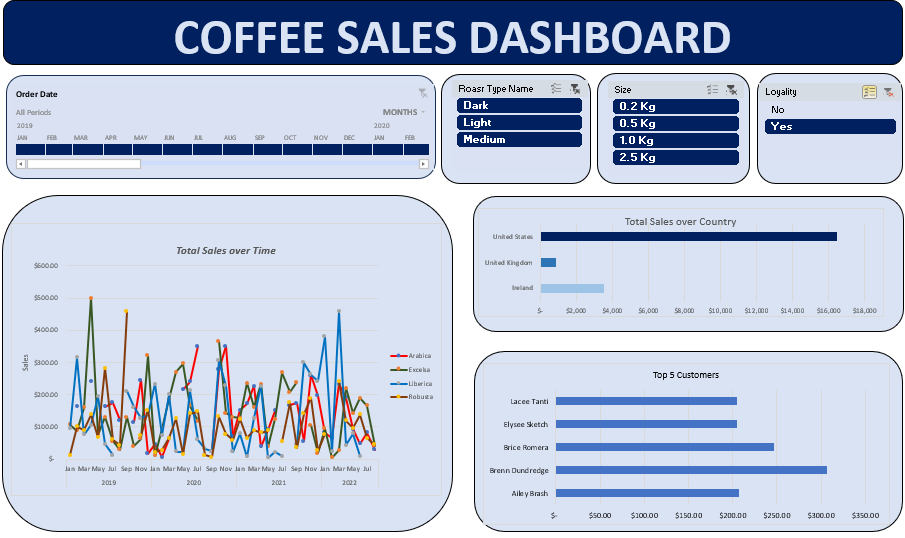

# ☕ Coffee Shop Sales Analysis – Excel Project  

## 📌 Executive Summary  
This project focuses on analyzing a **Coffee Shop Sales Dataset** using **Microsoft Excel**.  
The objective was to consolidate customer and product information into the orders table and then build an **interactive dashboard** to provide insights into:  

- Total sales over time  
- Total sales by country  
- Top 5 customers  
- Customer and product trends with filtering options  

All analysis and visualization were done in Excel using **lookup functions, pivot tables, pivot charts, and slicers**.  

---

## 📊 Project Screenshot  
  

---

## 📂 Dataset  
The dataset is available in **`coffeeOrdersData.xlsx`** and contains the following sheets:  
- **Customers**  
- **Products**  
- **Orders**  

You can [download and explore the dataset here](coffeeOrdersData.xlsx).  

---

## 🚀 How to Use  
1. Download and open the dataset `coffeeOrdersData.xlsx`.  
2. Check the **Orders Table** (with customer and product details combined).  
3. Open the **Dashboard sheet** to explore sales insights with slicers.  

---

## 🎯 Key Features  
- Consolidated **Orders Table** with customer and product details.  
- Interactive dashboard with:  
  - Sales over time  
  - Sales by country  
  - Top 5 customers  
- Slicers for filtering by timeline, roast type, size, and loyalty status.  

---

## 📁 Files in Repository  
- `coffeeOrdersData.xlsx` – Dataset with Customers, Products, and Orders.  
- `Dashboard.png` – Screenshot of the Excel Dashboard.  
- `README.md` – Project documentation.  

---

## 🏷️ Tags  
`Excel` `Data Analysis` `Dashboard` `Sales Analysis` `Coffee Shop Data` `Data Visualization`  
